<div align="center">

# DC Cut

### Interactive Dispersion Curve Editor

[](https://www.gnu.org/licenses/gpl-3.0)
[](https://www.python.org/downloads/)
[](https://www.riverbankcomputing.com/software/pyqt/)

A modern, interactive **Qt-based desktop application** for editing, visualization, and analysis of **surface wave dispersion curves** from **MASW (Multichannel Analysis of Surface Waves)**, **passive FK/FDBF**, and **circular seismic array** data.

**Author:** Mersad Fathizadeh — Ph.D. Candidate, University of Arkansas  
📧 mersadf@uark.edu · GitHub: [@mersadfathizadeh1995](https://github.com/mersadfathizadeh1995)

</div>

---

## Overview

DC Cut streamlines the workflow of cleaning, editing, and exporting dispersion curve picks commonly produced by MASW / passive FK / FDBF processing software (e.g., Geopsy, SurfSeis, MATLAB toolboxes). It replaces tedious manual editing in spreadsheets or MATLAB with a purpose-built interactive GUI — supporting active, passive, and circular array geometries in a single application.

### Key Capabilities

| Feature | Description |
|---------|-------------|
| **Multi-Format Import** | MATLAB `.mat` (MASW), CSV, Geopsy `.max` (passive FK), TXT, and saved session files |
| **Interactive Editing** | Box-select, line-delete, and inclined-rectangle tools for precise outlier removal |
| **Filtering** | Velocity, frequency, and wavelength range-based filters to clean data |
| **Near-Field Evaluation** | NACD (Normalized Array Center Distance) criteria for near-field effect assessment |
| **Statistical Averaging** | Frequency-binned and wavelength-binned averaging with uncertainty envelopes |
| **Spectral Power Overlay** | Load and display power spectrum backgrounds from `.npz` files |
| **Layer Management** | Per-layer visibility, color, marker, and style customization |
| **Export Wizard** | Resample, smooth, and export cleaned curves to Geopsy-compatible TXT, CSV, or state files |
| **Report Generation** | Comprehensive generator for camera-ready plots with uncertainty bands |
| **Undo / Redo** | Full history stack for all editing operations |

---

## Visual Tour

### 🖥️ Main Window

Dual-panel workspace with frequency-domain and wavelength-domain plots side by side. The left dock provides a hierarchical layer tree with point counts, while the right dock controls per-layer visibility and average curve toggles.

<p align="center">
  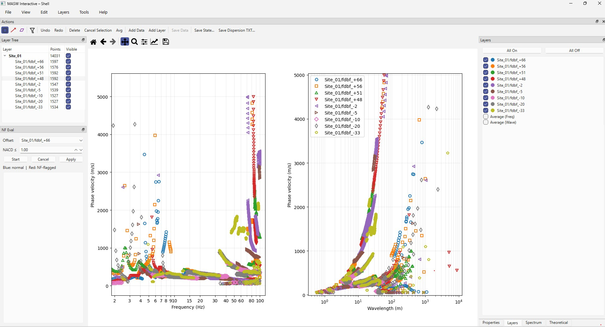
</p>

---

### 📂 Data Loading

Import data from multiple sources and formats. Each file becomes a branch in the layer tree. Supports Active MASW, Passive FK, Circular Array, and saved session modes.

<p align="center">
  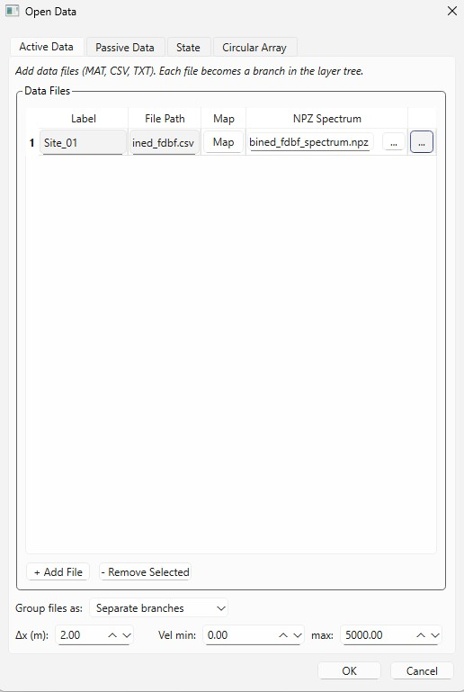
  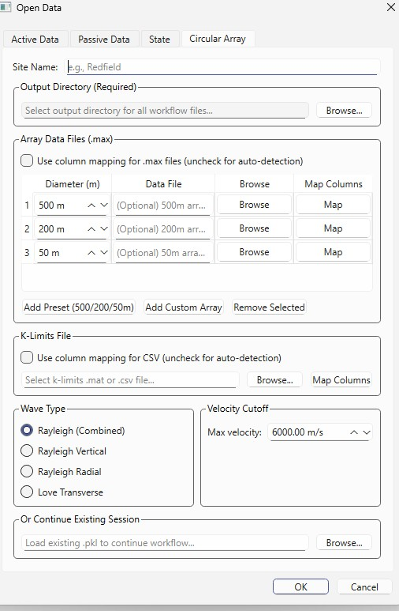
</p>
<p align="center"><em>Active data import (left) and circular array configuration (right)</em></p>

---

### 🎯 Editing & Refinement Tools

Multiple selection tools — Box Select, Line Delete, and Inclined Rectangle — allow precise removal of outlier picks directly on the dispersion plot. Power spectrum contours can be overlaid for guided editing.

<p align="center">
  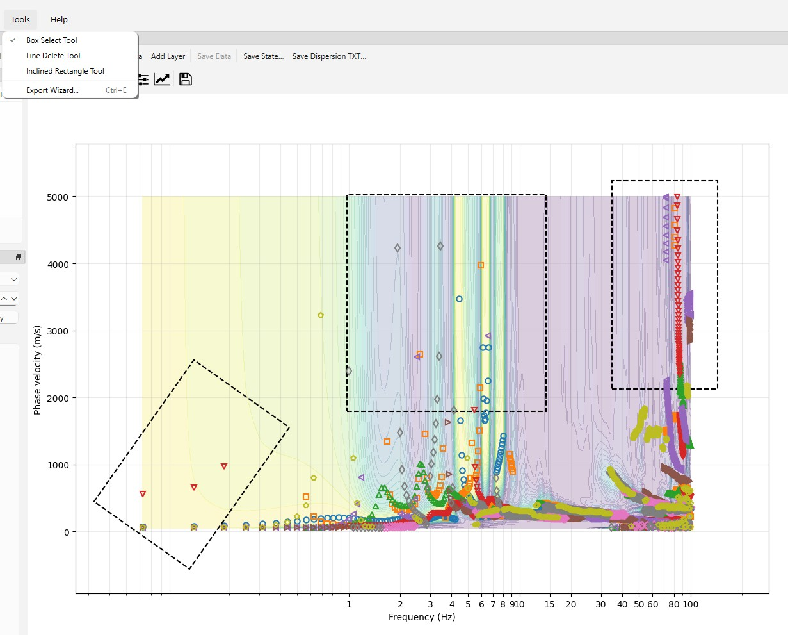
</p>

<p align="center">
  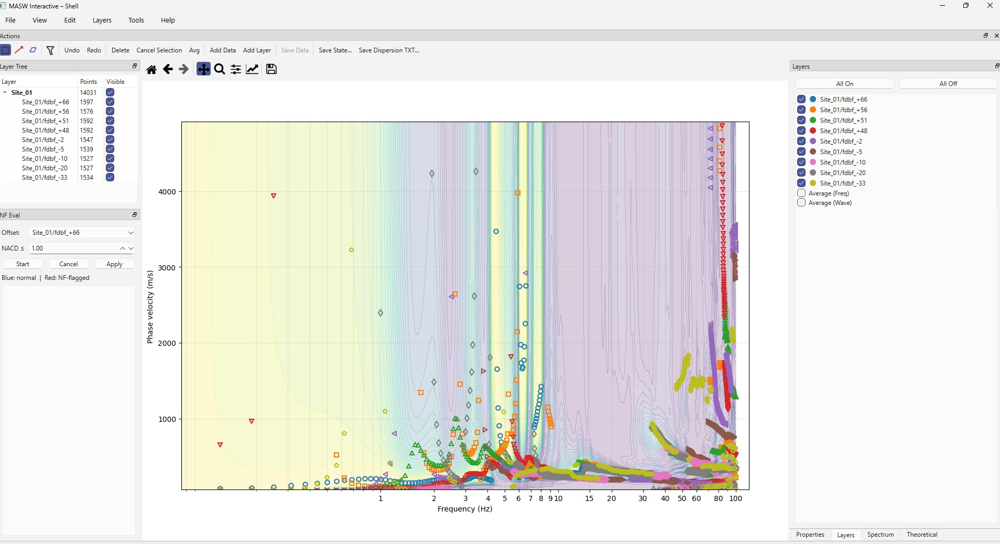
</p>
<p align="center"><em>Spectral power contour overlay for visually guided curve picking</em></p>

---

### 🔧 Filtering

Apply threshold-based filters on frequency, velocity, or wavelength to quickly remove unwanted data ranges. The filter dialog works on the active view and respects layer visibility.

<p align="center">
  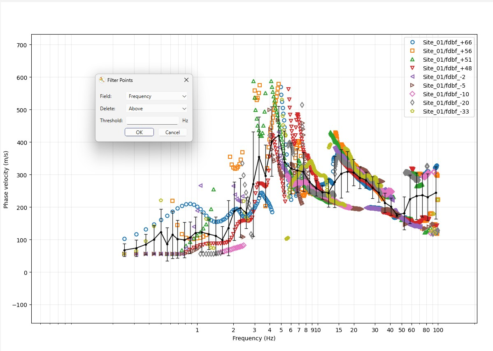
</p>

---

### 📡 Near-Field Evaluation

Evaluate near-field contamination using the NACD (Normalized Array Center Distance) criterion. Points with NACD below a configurable threshold are flagged in red. A per-offset checklist lets you review and selectively apply deletions.

<p align="center">
  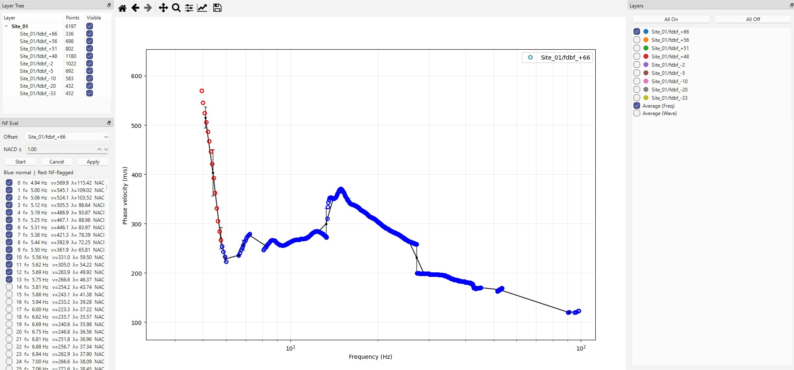
</p>

---

### 📊 Report Generation

A comprehensive figure export dialog with categorized plot types — frequency/wavelength domain curves, modal analysis, uncertainty visualization, near-field analysis, spectral grids, and more. Configurable styling, axis limits, and output format (PDF, SVG, PNG, EPS).

<p align="center">
  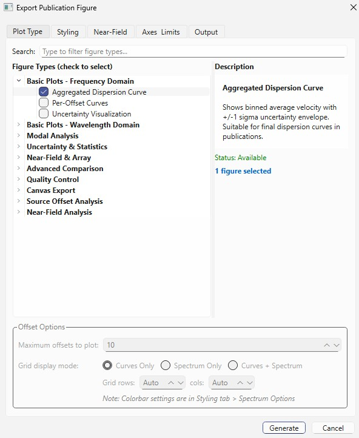
</p>

<details>
<summary><strong>📈 Example Output Figures (click to expand)</strong></summary>
<br>

DC Cut generates a comprehensive set of publication-quality figures:

<p align="center">
  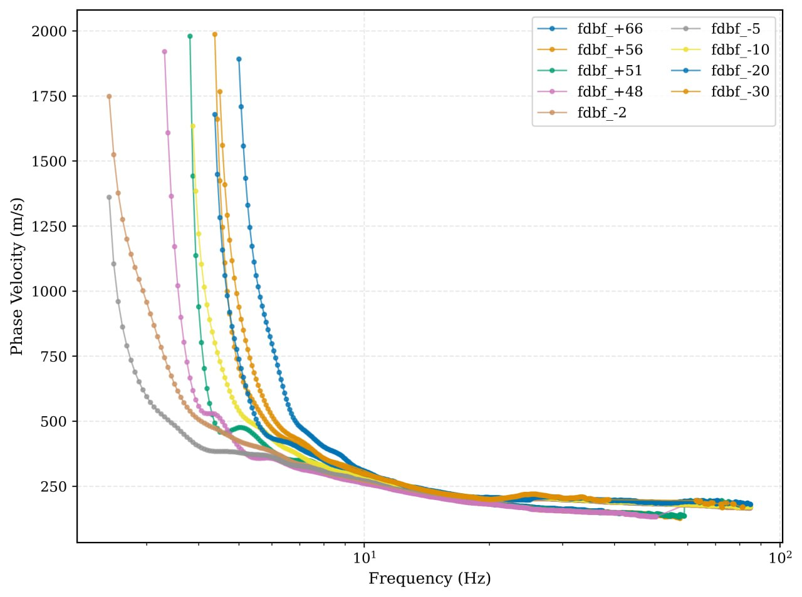
  <br><em>Per-offset dispersion curves — phase velocity vs. frequency</em>
</p>

<p align="center">
  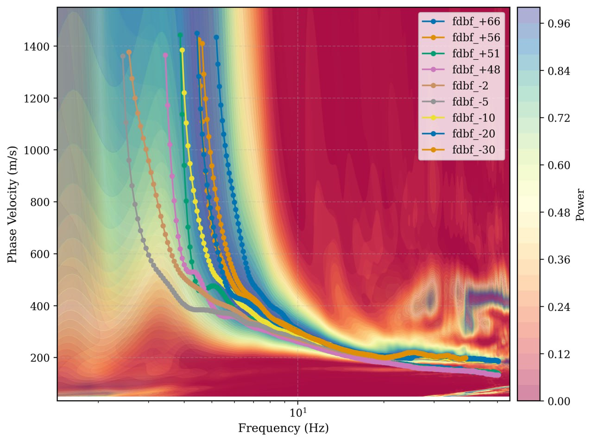
  <br><em>Dispersion curves overlaid on spectral power background</em>
</p>

<p align="center">
  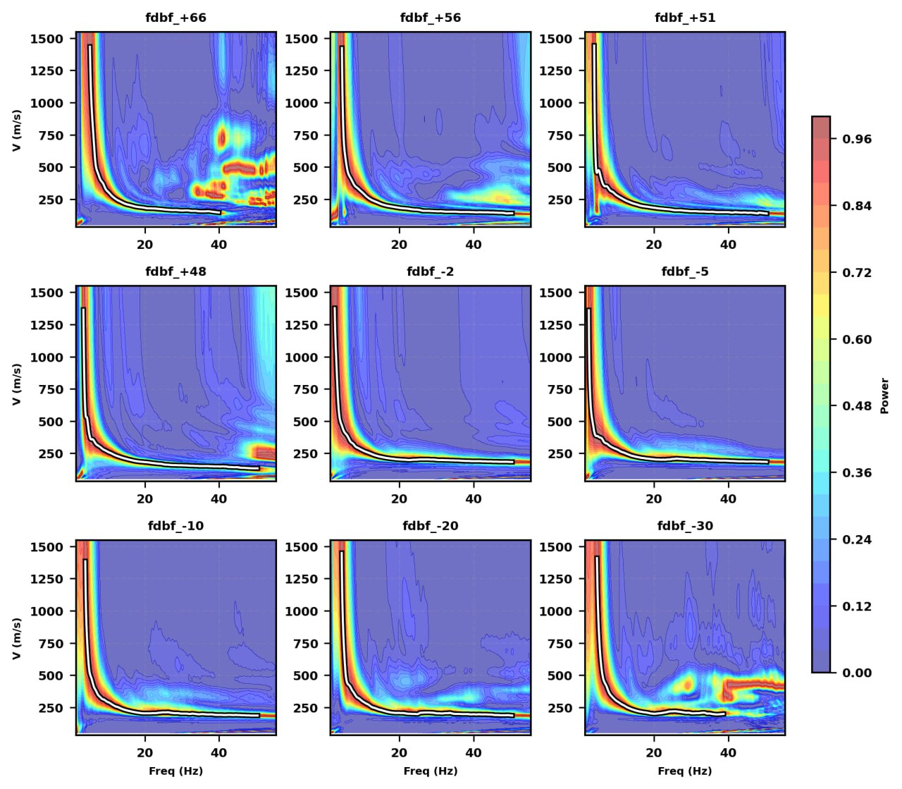
  <br><em>Per-offset spectrogram grid with picked dispersion curves</em>
</p>

<p align="center">
  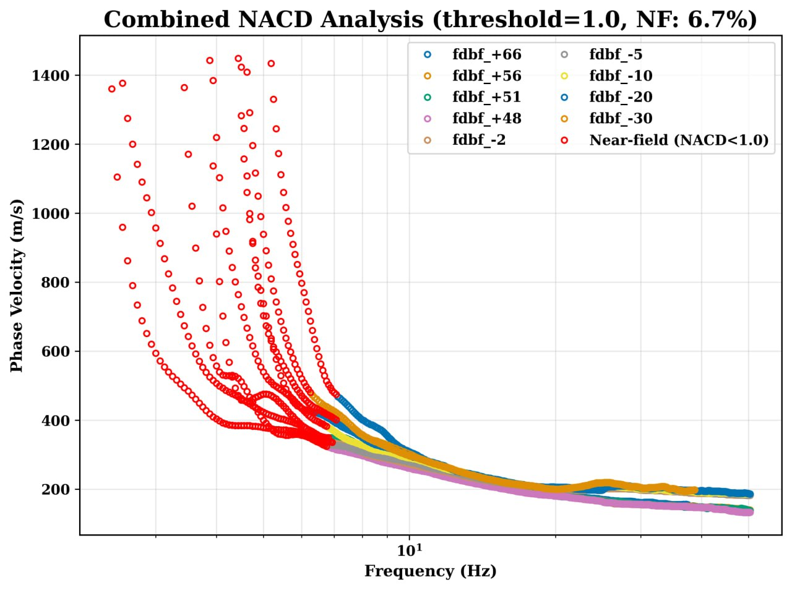
  <br><em>Combined NACD analysis — near-field flagged points shown in red</em>
</p>

<p align="center">
  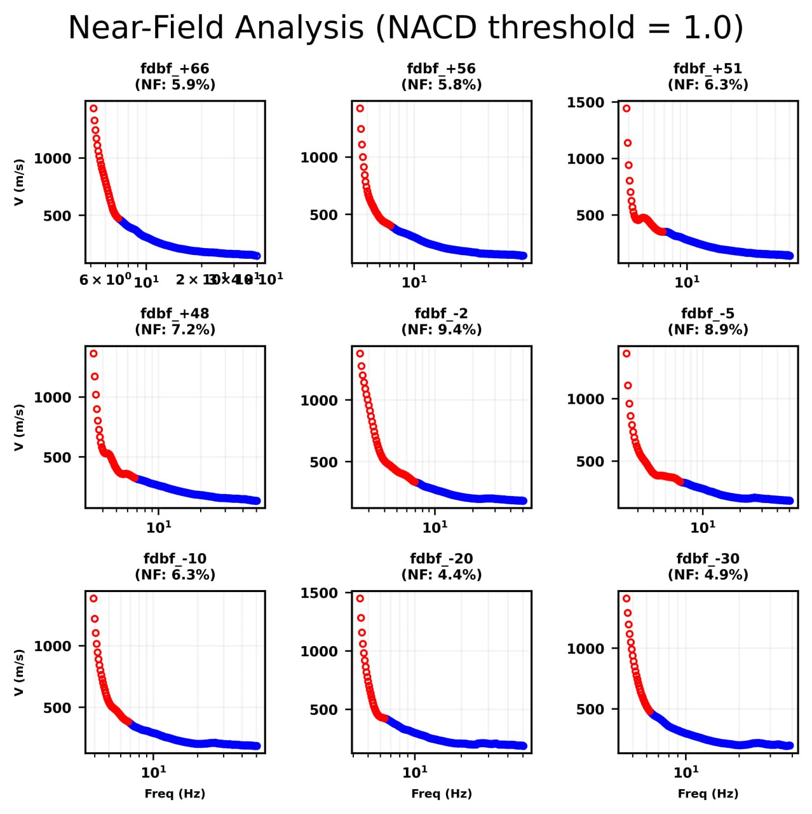
  <br><em>Per-offset near-field analysis with NF percentages</em>
</p>

<p align="center">
  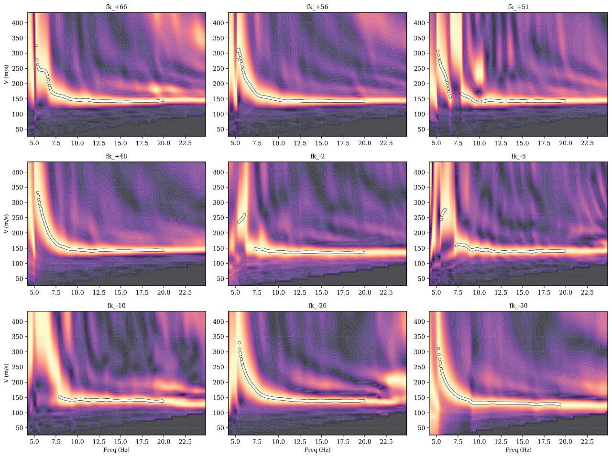
  <br><em>Per-offset FK spectrogram grid</em>
</p>

</details>

---

## Installation

### Prerequisites

- **Python 3.10** or newer
- **pip** (included with Python)

### 1. Clone the Repository

```bash
git clone https://github.com/mersadfathizadeh1995/Dispersion_Cut.git
cd Dispersion_Cut/dc_cut
```

### 2. Create a Virtual Environment (recommended)

```bash
# Windows
python -m venv .venv
.venv\Scripts\activate

# Linux / macOS
python3 -m venv .venv
source .venv/bin/activate
```

### 3. Install Dependencies

```bash
pip install numpy pandas matplotlib scipy PyQt6
```

<details>
<summary><strong>Core Dependencies</strong></summary>

| Package | Purpose |
|---------|---------|
| **NumPy** | Array operations and data processing |
| **Pandas** | CSV / tabular data parsing |
| **Matplotlib** | Plotting with the Qt backend (`QtAgg`) |
| **SciPy** | `.mat` file loading |
| **PyQt6** | Qt GUI framework (PyQt5 also works) |

</details>

### 4. Run the Application

```bash
# Option A — as a Python module
python -m dc_cut

# Option B — runner script
python run_dc_cut.py
```

The **Launcher Window** will appear, letting you select a data file and processing mode (Active, Passive, Circular Array, or State).

---

## Usage

### Quick Start

1. **Launch** — Run `python -m dc_cut`
2. **Select mode** — Choose *Active*, *Passive*, *Circular Array*, or load a saved *State*
3. **Browse file** — Select your `.mat`, `.csv`, `.max`, or state file
4. **Edit** — Use box-select (click-drag) to highlight outliers, then press `Delete`
5. **Filter** — Apply velocity / frequency / wavelength range filters from the Edit menu
6. **Average** — Toggle the average curve in the Layers panel
7. **Export** — Open the Export Wizard (`Ctrl+E`) to resample and save cleaned curves

### Keyboard Shortcuts

| Action | Shortcut |
|--------|----------|
| Show Both Plots | `Ctrl+1` |
| Show Frequency Plot Only | `Ctrl+2` |
| Show Wavelength Plot Only | `Ctrl+3` |
| Undo | `Ctrl+Z` |
| Redo | `Ctrl+Y` |
| Delete Selection | `Delete` |
| Cancel Selection | `Esc` |
| Save State | `Ctrl+S` |
| Export Wizard | `Ctrl+E` |
| Show Shortcuts Help | `F1` |

---

## Supported File Formats

### Input Formats

| Format | Extension | Description |
|--------|-----------|-------------|
| MATLAB | `.mat` | MASW dispersion data (`FrequencyRaw`, `VelocityRaw`, `setLeg` keys) |
| CSV | `.csv` | Comma-separated columns: `Freq(label)`, `Vel(label)`, `Wave(label)` per offset |
| Geopsy FK | `.max` | Passive FK picks from Geopsy (7-column format) |
| Text | `.txt` | Tab/space-delimited dispersion data |
| Spectrum | `.npz` | Power spectrum grid (frequencies, velocities, power) |
| Session | `.pkl` | Saved DC Cut session (pickled state) |

### Output Formats

| Format | Extension | Description |
|--------|-----------|-------------|
| Geopsy TXT | `.txt` | Frequency, slowness, DinverStd, number of points |
| Passive Stats | `.csv` | Mean frequency, slowness, uncertainty, and point count |
| Session State | `.pkl` | Complete session for later restore |
| Report Figures | `.pdf` / `.svg` / `.png` / `.eps` | Camera-ready vector and raster figures |

---

## Project Structure

```
dc_cut/
├── app.py                  # Entry point, LauncherWindow, main()
├── run_dc_cut.py           # Simple runner script
├── __main__.py             # python -m dc_cut entry
├── __init__.py             # Package init
│
├── core/                   # Business logic
│   ├── controller.py       # Main controller (editing, undo/redo, state)
│   ├── base_controller.py  # Figure/axes, lines, selection tools
│   ├── model.py            # LayersModel, LayerData dataclasses
│   ├── selection.py        # Point selection & removal
│   ├── filters.py          # Velocity/frequency/wavelength filters
│   ├── averages.py         # Statistical binning & averaging
│   ├── nearfield.py        # NACD near-field evaluation
│   ├── plot.py             # Legend assembly helpers
│   └── controller_modules/ # Handler mix-ins (visualization, file I/O, etc.)
│
├── gui/                    # Qt widgets & dialogs
│   ├── main_window.py      # MainWindow with menus, toolbar, docks
│   ├── layer_tree_dock.py  # Layer tree with right-click settings
│   ├── layers_dock.py      # Simple layer visibility list
│   ├── open_data.py        # Open / Append data dialog
│   ├── add_point_dialog.py # Add point to layer dialog
│   └── layer_settings_dialog.py  # Per-layer color/marker settings
│
├── io/                     # File readers & writers
│   └── universal.py        # Unified parser for MAT, CSV, TXT, MAX
│
├── export_wizard/          # Export Wizard window
│   ├── wizard_main.py      # Main wizard window
│   ├── wizard_canvas.py    # Interactive resampling canvas
│   ├── wizard_table.py     # Editable data table
│   ├── data_model.py       # CurveDataModel
│   └── processing_panel.py # Smoothing & resampling controls
│
├── packages/report_generation/  # Report generation (publication-quality figures)
├── services/               # Preferences, theming, logging, actions
├── circular_array/         # Circular array processing
├── theoretical_curves/     # Theoretical curve overlay support
│
└── example/                # Example data files for testing
    ├── Active_array/       # MASW .mat and .csv examples
    ├── LADC/               # Passive FK .max example
    ├── RTBF/               # Circular array example
    └── theoretical_curves/ # Inversion result overlays
```

---

## Architecture

DC Cut follows a **layered, modular architecture** with an Action Registry:

| Layer | Location | Role |
|-------|----------|------|
| **Core** | `core/` | Business logic — data manipulation, filtering, averaging, near-field evaluation, undo/redo |
| **GUI** | `gui/` | PyQt6 application with menus, toolbars, docks, and Matplotlib-embedded canvases |
| **I/O** | `io/` | Format-specific readers and writers (MAT, CSV, MAX, TXT, state) |
| **Export Wizard** | `export_wizard/` | Interactive resampling, smoothing, and export pipeline |
| **Report Generation** | `packages/report_generation/` | Publication-quality figure generator with extensive plot type catalog |
| **Services** | `services/` | Cross-cutting concerns — preferences, theming, logging, action registry |

---

## Contributing

Contributions are welcome! Please:

1. Fork the repository
2. Create a feature branch (`git checkout -b feature/my-feature`)
3. Commit your changes (`git commit -m "Add my feature"`)
4. Push to the branch (`git push origin feature/my-feature`)
5. Open a Pull Request

---

## Acknowledgments

This work was developed under the guidance of **Dr. Clinton Wood** at the University of Arkansas.

---

## Citation

If you use DC Cut in your research, please cite:

> Rahimi, M., Wood, C., Fathizadeh, M., & Rahimi, S. (2025). A Multi-method Geophysical Approach for Complex Shallow Landslide Characterization. *Annals of Geophysics*, 68(3), NS336. <https://doi.org/10.4401/ag-9203>

---

## License

Copyright (C) 2025 Mersad Fathizadeh

This program is free software: you can redistribute it and/or modify it under the terms of the **GNU General Public License v3.0** as published by the Free Software Foundation.

See the [LICENSE](LICENSE) file for details.
